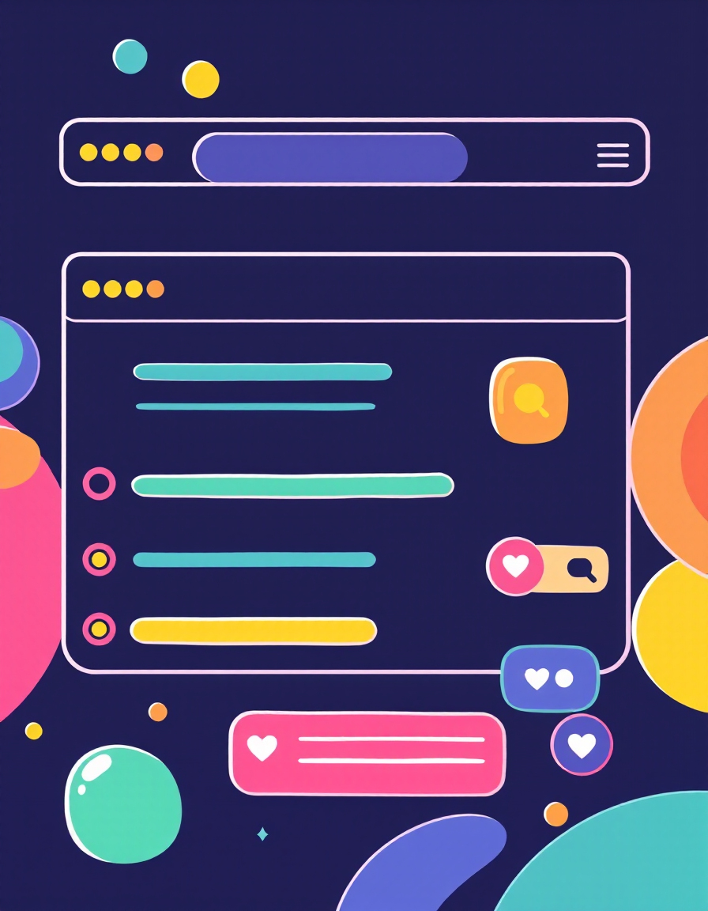

# Klik: Speelse interactieve kunstwerken op het web

---

In deze workshop gaan we code gebruiken om interactieve en speelse kunstwerken te maken voor het web. We gaan leren hoe we interactieve elementen kunnen maken. Bijvoorbeeld hoe maken we een knop en wat gebeurd er dan? Of een slider die een afbeelding groot en klein kan maken maakt. Aan het eind maak je zelf iets leuks en speels met de elementen die je hebt geleerd.

---

## Wat gaan we leren?

**Basisbegrippen van p5.js:** Leer hoe je setup(), draw(), createCanvas(), en background() gebruikt om een basis te leggen voor je projecten.

**Interactie met de Muis:** Leer hoe je de muispositie kunt gebruiken en reageren op muisklikken met mousePressed en mouseIsPressed.

**Tekenen en Kleuren:** Leer hoe je vormen zoals ellipsen tekent en kleuren instelt met fill() en background().

**Voorwaardelijke Logica:** Leer hoe je voorwaardelijke statements (if statements) en boolean variabelen kunt gebruiken om interactieve elementen te maken.

**GIF's Laden en Tonen:** Leer hoe je GIF's kunt laden, tonen en verbergen, en hoe je deze kunt veranderen op basis van toetsaanslagen met keyTyped().

## Programma
* Kennismaken en voorbeelden
* Introductie - wat is interactie
* Aan de slag met p5.js 
* Knop maken
+ Gif's tonen

