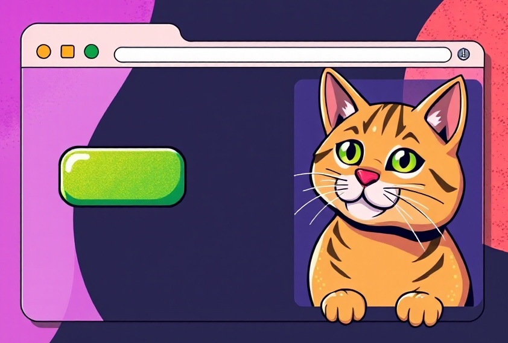

# 1: Opdracht 1

In de vorige lessen hebben jullie een aantal programmeer functies gebruikt. 
Gebruik deze in de volgende opdracht

Maak voor de opdracht het volgende:
* Maak een knop 
* wanneer je op de knop druk zie je een gif verschijnen

* Tips: gebruik als start je vorige opdracht met de twee gifs.
haal eruit wat eruit kan, voeg toe wat er kan worden toegevoegd


* extra: maak meerdere knoppen met meerdere gifs.





### eigen gif zoeken
- 

verander de code tussen `https://media.giphy.com/media/` & `giphy.gif` met de code in de URL

```javascript
createImg("https://media.giphy.com/media/1pAhncsuyFjcixgtLY/giphy.gif");
```